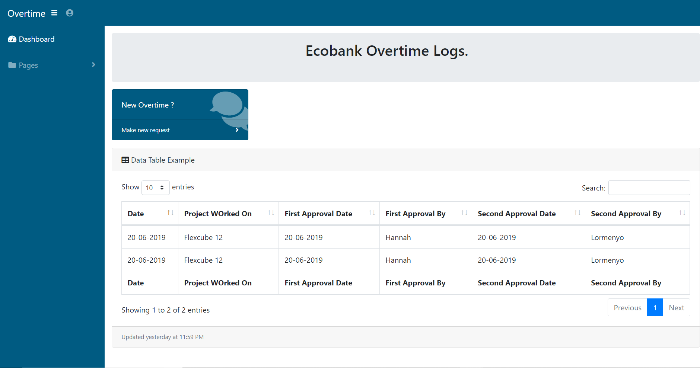

# Overtime-Java-Server-Faces

## Features 

### Login page

This is the page where the developers log into the portal.

### Dashboard 

This view is for the developers to see their respective overtime logs.
It also has links that redirects the developers to other pages like a page to track the approvals.

### Reuest page

This has a form where the developers request for the overtime.

## Things to add
- An approval tracker 
- An email notification system
- Authentication for the people who give approvals 
- Authentication at the Login(for the Developers)
- Logging out 
- Add  checklist to the request form for the deveopers to check the tasks they weere able to accomplish during the ovetime.
- Add project field to the form.

